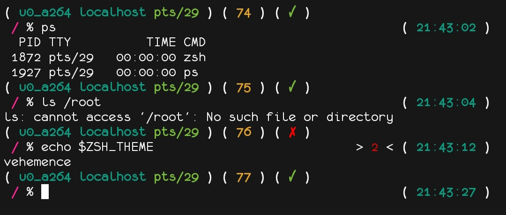
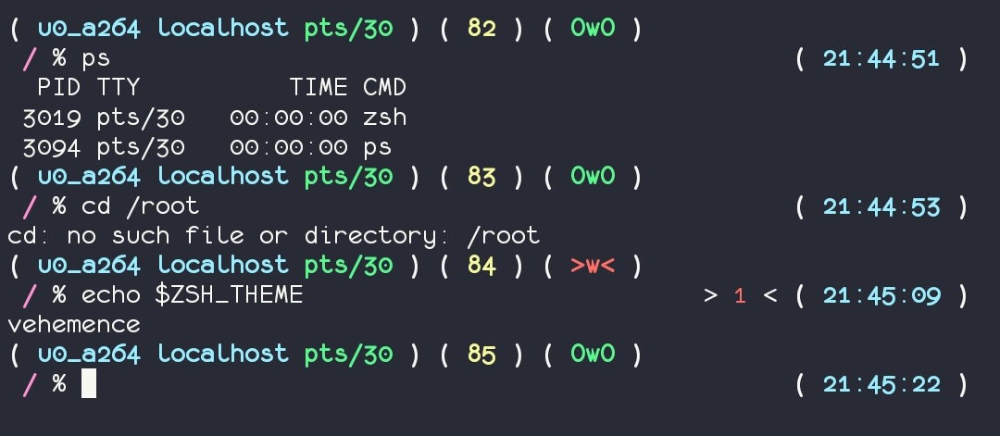

What is?
-----------
**Vehemence** - just a two-line theme, that shows
pwd, username/localhost, tty, time, error code and other things.

Also, in the theme file there is a variable "indicator" that allows you to change the error indicator itself. For example, a value of "1" produces "a cross and a check mark", which can be seen in the first screenshot. With a value of "2", they give out the faces "OwO" and ">w<", which are visible in the second screenshot. If the value is 0, the indicator is absent.

*Theme by h1n1-dev and tupzikapi.*

Screenshots
-----------

